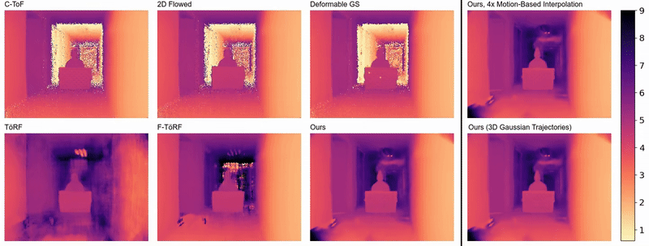
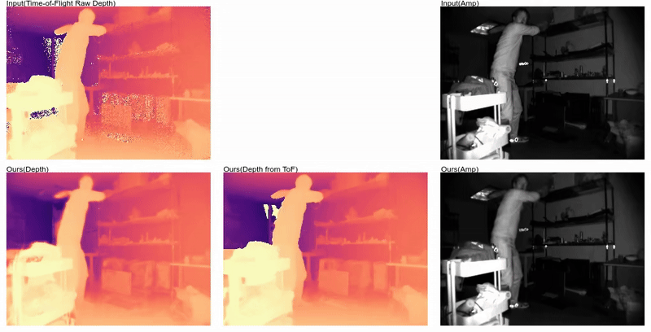

# Time of the Flight of the Gaussians: Optimizing Depth Indirectly in Dynamic Radiance Fields
### [Project Page](https://visual.cs.brown.edu/gftorf) | [Paper](https://openaccess.thecvf.com/content/CVPR2025/html/Li_Time_of_the_Flight_of_the_Gaussians_Optimizing_Depth_Indirectly_CVPR_2025_paper.html) | [arXiv (Latest)](https://arxiv.org/abs/) | [Pre-trained Models](https://drive.google.com/drive/folders/1MnhnnQfPCUg3YcxX6mUVEy_y9tjKEfcj?usp=sharing) | [F-TöRF Data](https://1drv.ms/f/c/4dd35d8ee847a247/EsiF6mb15ZlKlTZmg8N_OIcBCaQGUmWWVNOldMTaRsQXeQ?e=eIy7Rz) | [TöRF Data](https://drive.google.com/drive/folders/18QsJeCYjqtfYCtduzeDMuulgW6EpF4wO?usp=sharing)
[Runfeng Li](https://ranrandy.github.io), 
[Mikhail Okunev](https://mmehas.github.io),
[Zixuan Guo](https://www.linkedin.com/in/zixuan-g-35a05a1a2),
[Anh Ha Duong](https://www.linkedin.com/in/anh-duong-b88a871b3),
[Christian Richardt](https://richardt.name/)<sup>∞</sup>,
[Matthew O'Toole](https://www.cs.cmu.edu/~motoole2)<sup>*</sup>,
[James Tompkin](www.jamestompkin.com)<br>
Brown University, <sup>∞</sup>Meta Reality Labs, *Carnegie Mellon University

## Quick Start
To set up the environment, run<br>
```
conda env create -f environment.yml
conda activate gftorf
```
*If your machine (hardware & software) is compatible with the [original 3DGS](https://github.com/graphdeco-inria/gaussian-splatting), then you should have no problem setting up our environment.*<br>
<!-- *Instructions on this page have been tested on win10 with an NVIDIA 4060Ti 16GB GPU*<br> -->
Next, you have two options:
### Option A: Render using pre-trained models
1. To download pretrained models, run:
    ```
    python prepare_models.py
    ```
2. Modify arguments in `run_render.py` if needed, then run:
    <br>(*You might need to modify the IMAGEMAGICK path in `conf.py` to compose video panels.*)
    ```
    python run_render.py
    ```
    You should get the exact video panels as shown on our project page, such as:

    

### Option B: Optimize from scratch
*This can take at most 60 minutes for one scene on a single NVIDIA 3090 GPU.*
1. Download F-TöRF [`real_scenes.zip`, `synthetic_scenes.zip`](https://1drv.ms/f/c/4dd35d8ee847a247/EsiF6mb15ZlKlTZmg8N_OIcBCaQGUmWWVNOldMTaRsQXeQ?e=eIy7Rz) and TöRF [`copier`, `cupboard`, `deskbox`, `phonebooth`, and `studbook` scenes](https://drive.google.com/drive/folders/18QsJeCYjqtfYCtduzeDMuulgW6EpF4wO?usp=sharing) to the `data/` folder, and then run:
    ```
    python prepare_data.py
    ```
2. Modify arguments in `run_optimize.py` if needed, then run:
    ```
    python run_optimize.py
    ```
    You can get some decent looking results after 20k iterations, such as:<br> 
    (though training longer would usually be better)

    

## Citation
```
@InProceedings{Li_2025_CVPR,
  author    = {Li, Runfeng and Okunev, Mikhail and Guo, Zixuan and Duong, Anh Ha and Richardt, Christian 
              and O'Toole, Matthew and Tompkin, James},
  title     = {Time of the Flight of the Gaussians: Optimizing Depth Indirectly in Dynamic Radiance Fields},
  booktitle = {Proceedings of the Computer Vision and Pattern Recognition Conference (CVPR)},
  month     = {June},
  year      = {2025},
  pages     = {21021-21030}
}
```
